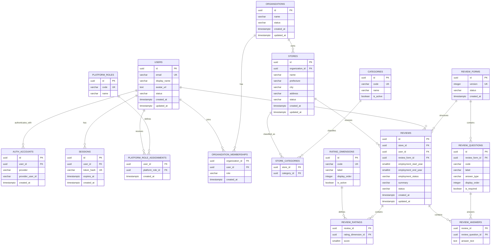

# アルバイト口コミWebアプリ 開発設計書

## 1. 目的と設計原則

本書はMVP実装の技術構成、認証・認可、DB設計を定義する。初期段階では機能開発を優先し、デプロイとAI機能は対象外とする。

- ユーザーを種類別のテーブルへ分割しない
- 認証方法、プラットフォーム権限、組織内権限を分離する
- 質問や評価軸を追加してもテーブル変更を不要にする
- 画面やRouteからDBを直接操作しない
- 変更が予想される箇所だけを分離し、過度に汎用化しない

## 2. 技術スタック

| 領域 | 採用技術 |
|---|---|
| Full-stack | TanStack Start |
| Language | TypeScript（strict） |
| UI | React / Tailwind CSS / shadcn/ui |
| Routing / State / Form | TanStack Router / Query / Form |
| Validation | Zod |
| Database | PostgreSQL |
| ORM / Migration | Drizzle ORM / Drizzle Kit |
| Authentication | 開発用HTTP Basic認証＋アプリ内Session |
| Test | Vitest / Playwright |
| Package manager | pnpm |

単一のTanStack Startアプリとして構築し、独立Backendやモノレポは設けない。

## 3. アプリケーション構成

```text
Browser → TanStack Start
             ├─ Routes / UI
             ├─ Server Functions
             ├─ AuthAdapter / Authorization Policy
             ├─ Use Cases
             └─ Drizzle ORM → PostgreSQL
```

画面から使う処理はServer Functionsとする。外部APIが必要になった場合だけServer Routesを追加し、同じUse Caseを呼び出す。

## 4. ディレクトリ構成

```text
src/
├─ routes/
├─ features/
│  ├─ auth/
│  ├─ stores/
│  ├─ reviews/
│  ├─ profile/
│  └─ organizations/
├─ components/
├─ server/
│  ├─ auth/
│  ├─ authorization/
│  ├─ use-cases/
│  └─ errors/
├─ db/
│  ├─ schema/
│  ├─ migrations/
│  ├─ seed.ts
│  └─ client.ts
├─ schemas/
└─ lib/
```

依存方向は`Route → Server Function → Use Case → Repository/DB`とする。

## 5. 認証・認可設計

### 5.1 概念の分離

| 概念 | 管理対象 |
|---|---|
| User | サービスを利用する人 |
| AuthAccount | Basic、Google等の本人確認手段 |
| Session | ログイン状態 |
| PlatformRole | サービス全体に対する管理権限 |
| OrganizationMembership | 組織への所属と組織内権限 |

一般利用者であることはRoleではない。有効なUserは店舗閲覧や口コミ投稿ができる。同じUserが口コミを投稿しながら、複数組織の管理者になることも許容する。

### 5.2 認証境界

```ts
type AuthenticatedPrincipal = {
  userId: string
  sessionId: string
}

interface AuthAdapter {
  authenticate(request: Request): Promise<AuthenticatedPrincipal | null>
}
```

`AuthAdapter`は本人を特定するだけで権限を返さない。Authorization PolicyがDB上のPlatformRoleとOrganizationMembershipから権限を判定する。

初期実装ではBasic認証通過後に固定テストUserを選択し、アプリ内Sessionを発行する。将来Google OAuthを追加する場合はAuthAccountを追加して既存Userへ紐づける。Review等の業務テーブルは変更しない。

### 5.3 認可ルール

| 操作 | 条件 |
|---|---|
| 店舗・口コミ閲覧、口コミ投稿 | ACTIVEなUser |
| 口コミ編集・削除 | 投稿者本人またはPlatform ADMIN |
| 組織ダッシュボード | 対象組織のMembership保有者またはPlatform ADMIN |
| 店舗管理 | 対象組織でOWNERまたはMANAGER |
| サービス全体の管理 | Platform ADMIN |

- 未認証は`401`、権限不足は`403`
- Basic認証資格情報は環境変数で管理し、DBへ保存しない
- Session Cookieは`HttpOnly`、`SameSite=Lax`
- DBにはSession Tokenのハッシュだけを保存する

## 6. DB設計

### 6.1 共通方針

- 主キーはUUID、日時は`timestamptz`、名前は`snake_case`
- 外部キーカラムには原則Indexを付与する
- RoleやStatusは`varchar`＋CHECK制約で管理する
- 口コミや店舗は原則論理削除する
- 認証情報ではなく、必ず`users.id`を業務データの参照先にする

### 6.2 ER図



### 6.3 Identity・権限系

#### users

全利用者の共通情報。`role`は持たない。`email`は小文字へ正規化してUniqueとし、Statusは`ACTIVE / SUSPENDED / DELETED`とする。

#### auth_accounts

認証ProviderとUserの紐づけ。`UNIQUE(provider, provider_user_id)`と`UNIQUE(user_id, provider)`を設定する。

#### sessions

`user_id`、`token_hash`、`expires_at`、`created_at`を保持し、User削除時はCASCADEする。

#### platform_roles / platform_role_assignments

サービス全体の権限を管理する。初期Roleは`ADMIN`のみ。Assignmentの主キーは`(user_id, platform_role_id)`とする。

### 6.4 組織・店舗系

#### organizations

企業や運営法人など、店舗を所有する主体を表す。

#### organization_memberships

UserとOrganizationの関係。主キーは`(organization_id, user_id)`、Roleは`OWNER / MANAGER / VIEWER`とする。Userは複数Organizationへ所属できる。

#### stores

`organization_id`、店舗名、都道府県、市区町村、住所、Statusを持つ。口コミがある店舗は物理削除せず`INACTIVE`にする。

#### categories / store_categories

業種分類をマスタ化する。店舗とCategoryは多対多で、関連テーブルの主キーは`(store_id, category_id)`とする。

### 6.5 口コミ系

#### 投稿コンテンツとしての境界

Reviewは、投稿者・本文・公開状態・作成日時を持つ点ではブログやSNSの投稿と同じ性質を持つ。一方で、対象店舗、勤務経験、質問回答、評価値を持つため、汎用的な`contents`や`posts`へ抽象化せず、店舗口コミを表すAggregate Rootとして扱う。

```text
Review（Aggregate Root）
├─ 投稿としての共通情報
│  ├─ author
│  ├─ summary
│  ├─ status
│  └─ created_at / updated_at
└─ 店舗口コミ固有の情報
   ├─ store
   ├─ employment
   ├─ review_answers
   └─ review_ratings
```

Reviewの作成・編集・削除は必ずReview Use Caseを経由する。Review AnswerやReview Ratingを単独で外部公開・更新しない。投稿時にはReview、Answers、Ratingsを1トランザクションで保存する。

ブログ記事や通常のSNS投稿を実際に扱う要件が追加されるまでは、共通親テーブルを作らない。

#### review_forms / review_questions

投稿時の質問構成をVersion管理する。公開済みFormは変更せず、新しいVersionを作成する。Questionは`UNIQUE(review_form_id, code)`とする。

#### rating_dimensions

`overall`、`atmosphere`、`relationship`、`training`、`workload`等の評価軸を管理する。評価軸追加時にReviewsの変更は不要。

#### reviews

口コミの主体と勤務情報だけを保持する。主なIndexは`store_id`、`user_id`、`(store_id, status, created_at DESC)`とする。

Statusは`PUBLISHED / HIDDEN / DELETED`、Employment Statusは`CURRENT / FORMER`。開始年は終了年以下とする。

#### review_answers

主キーは`(review_id, review_question_id)`。QuestionとReviewが同じReviewFormに属することをUse Caseで検証する。

#### review_ratings

主キーは`(review_id, rating_dimension_id)`。`score`には1～5のCHECK制約を設定する。

#### 将来の投稿機能

SNS的な機能が必要になった場合は、Reviewを参照する独立テーブルとして追加する。

| 将来テーブル | 用途 | 主な一意制約 |
|---|---|---|
| review_comments | Reviewへのコメント・返信 | id |
| review_reactions | いいね等のリアクション | `(review_id, user_id, reaction_type)` |
| review_bookmarks | ユーザーの保存 | `(review_id, user_id)` |
| review_reports | 不適切なReviewの通報 | 要件確定時に定義 |

これらは初期Migrationへ含めない。複数種類の投稿に同じ機能を提供することが確定した場合に限り、共通Contentモデルへの再設計を検討する。

### 6.6 削除ルール

| 親 | 子 | 方針 |
|---|---|---|
| User | AuthAccount / Session | CASCADE |
| User | Review | Userを論理削除しReviewは保持 |
| Organization | Membership | CASCADE |
| Organization | Store | Organizationを論理削除しStoreは保持 |
| Review | Answer / Rating | CASCADE |
| ReviewForm | Question | 公開済みは削除禁止 |
| Category / RatingDimension | 利用データ | 物理削除せず無効化 |

### 6.7 初期データ

Seedで一般User、組織Owner、Platform ADMINを作成する。全員を`users`へ保存し、権限の違いはPlatformRoleとOrganizationMembershipで表現する。

併せてOrganization、Store、Category、ReviewForm、Question、RatingDimension、Reviewの確認用データを投入する。Seedは開発・テスト環境だけで実行可能にする。

## 7. Server Function設計

```text
認証 → Zod検証 → 認可 → Use Case → DB → Response
```

| Feature | 主な処理 |
|---|---|
| Auth | テストUser選択、Session取得、ログアウト |
| Store | 一覧、検索、詳細取得 |
| Review | Form取得、投稿、一覧、詳細、編集、削除 |
| Profile | 自分の情報、投稿履歴取得 |
| Organization | 所属店舗、店舗別評価、口コミ取得 |

DB Entityをそのまま画面へ返さず、Zodで定義したResponse Schemaへ変換する。

## 8. 環境変数

```env
DATABASE_URL=
BASIC_AUTH_USER=
BASIC_AUTH_PASSWORD=
SESSION_SECRET=
```

`.env`はGitへ追加しない。`.env.example`には変数名だけを記載し、起動時にZodで検証する。

## 9. テスト方針

- Authorization PolicyはPlatform Role、Membership、所有者条件をVitestで検証
- Zod Schemaは正常値、境界値、不正値を検証
- Use Caseはテスト用AuthAdapterで認証方式から独立して検証
- ReviewFormのVersionと回答Questionの整合性を検証
- Playwrightで口コミ投稿と組織ダッシュボードを検証
- Migration適用後にSeedを投入して主要Server Functionを疎通確認

## 10. 初期スコープ外

- Google OAuth等の外部認証
- AI口コミ分析、自然言語検索、Embedding、pgvector
- 画像アップロード
- コメント、リアクション、ブックマーク
- 通報・本格モデレーション
- デプロイ・本番インフラ設計
- Nativeアプリ向けAPI
